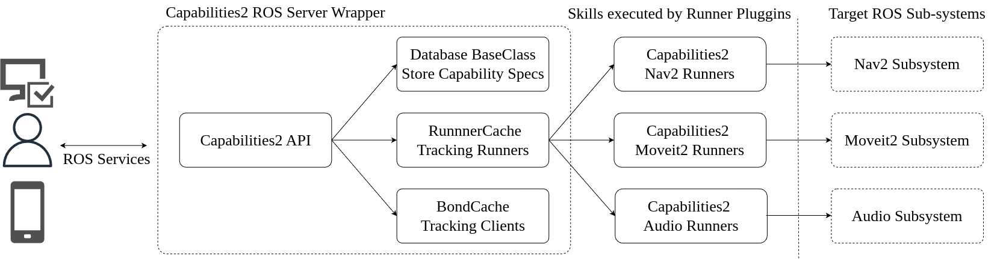
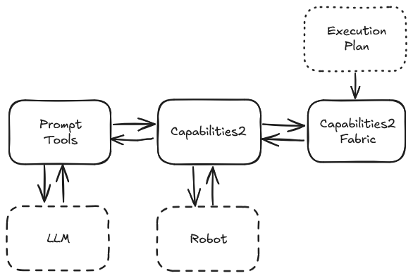
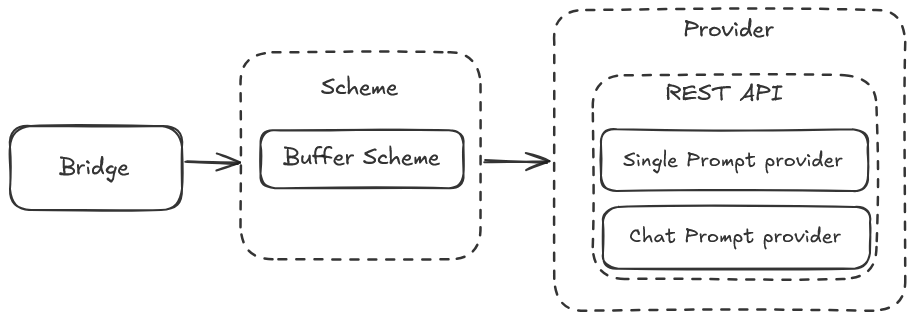
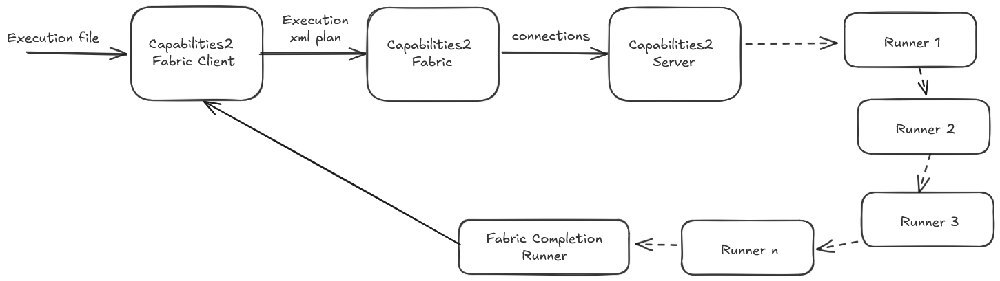
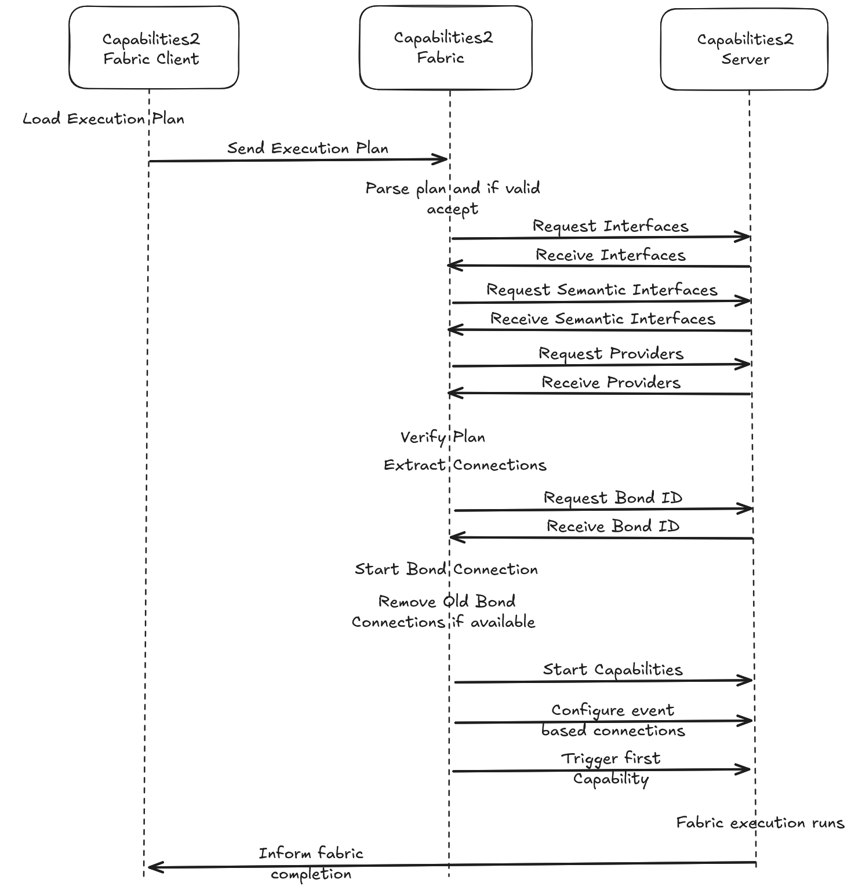
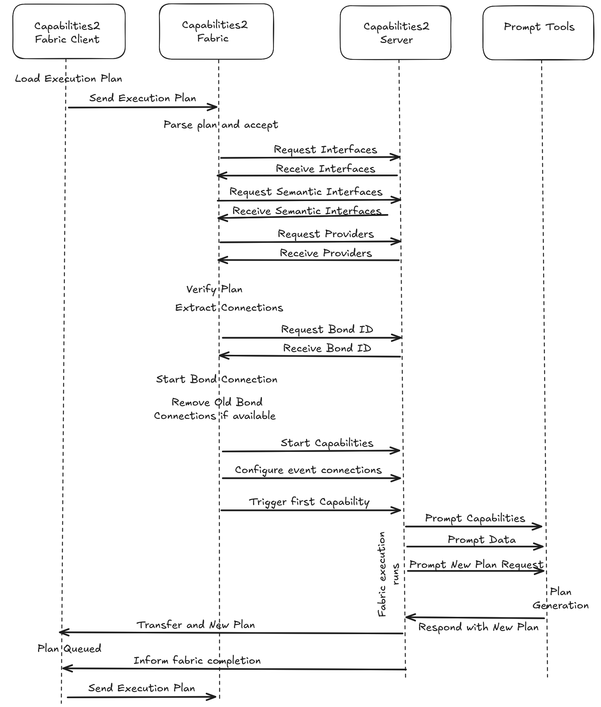
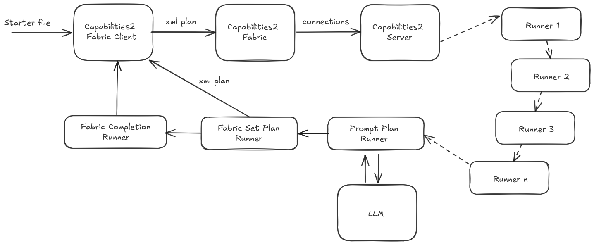

## Methodology

### Design goals

Capabilities2 was designed as a ROS2 reimplementation of the original ROS Capabilities framework with several explicit goals:

- introduce a standardised yet adaptable framework for representing robot skills in ROS-based systems;
- provide rich, descriptive capability representations that can answer what a robot can do outside the immediate control boundary;
- expose an extensible API that supports multiple execution mechanisms independent of the underlying skill implementation;
- reduce the integration effort required to build top-level control layers for real-world and HRI-focused applications; and
- support production-oriented security patterns, including behaviour-level access control through a proxy such as Rosbridge \cite{crick2012ros}.

Together, these goals define Capabilities2 not only as a software package, but as an interface layer between robot subsystems, higher-level planners, and external users or applications.

The GPSFSM paper extends these concerns into a broader generative-planning setting and makes the system requirements more explicit. It identifies four minimum requirements for generative behaviour planning across BT-, FSM-, or hybrid-style systems: a textual description of robot functionality, a textual representation of behaviour composition, a mechanism for coordinating with LLMs to generate that representation, and a mechanism for executing the generated behaviours. It also introduces a complementary operational goal: behaviour execution should be managed dynamically so that individual behaviours can be loaded and unloaded at runtime rather than keeping the entire control structure resident in memory.

That dynamic-management goal is tied to several intended benefits: optimised resource allocation, extended functional duration through reduced power use, improved fault tolerance by keeping unused components offline, and better handling of epistemic uncertainty in long-horizon tasks where the full behaviour sequence cannot be anticipated in advance. These points matter because they explain why the wider Contribution 1 stack evolved toward an event-driven Fabric architecture on top of Capabilities2 rather than toward a conventional monolithic planner.

### From Capabilities(1) to Capabilities2

The original ROS(1) Capabilities package exposed robot functions through a ROS service API and represented capability knowledge using interfaces, providers, semantic interfaces, and remappings \cite{woodall2014ros, quigley2009ros}. Providers were started and stopped using ROS launch files, allowing the capabilities server to manage system resources at runtime.

Capabilities2 preserves the separation between capability specification and capability implementation, but it replaces the ROS(1) execution model with a ROS2-oriented architecture built around composable services, actions, persistent models, and dynamically loaded plugins. Major design components are implemented as C++ classes and plugin-based interfaces, following patterns used in ROS2 frameworks such as Nav2 and MoveIt2 \cite{macenski2020marathon, coleman2014reducing, macenski2023impact}.

### Core architectural elements

The Capabilities2 paper identifies three core implementation changes.

First, capability models are stored through an ORM-backed database layer rather than as fixed in-memory structures. This introduces hot reloading, persistence, and the possibility of more modular ontology definitions. The database handler is deliberately abstracted so that alternative backends can be introduced later.

Second, provider execution is abstracted through a runner plugin API. Instead of coupling capability invocation to launch files alone, Capabilities2 allows capabilities to be executed through interchangeable mechanisms such as ROS actions, services, or other control abstractions. This broadens the system from a launch manager into a more general skill execution framework.

Third, Capabilities2 adds runtime capability registration through a ROS service. Capabilities can therefore be introduced by spawners or service callers during operation rather than only from YAML files declared in package manifests. In HRI settings, this is important because it allows a robot's available skills to be tuned, extended, or adapted while the system is running, and those changes can be retained through the database layer.

### Comparative summary

The main design differences between Capabilities(1) and Capabilities2 can be summarised as follows.

| Feature | Capabilities(1) | Capabilities2 |
| --- | --- | --- |
| Architecture | Basic skill representation structure | Modular plugin-based design for flexibility and extensibility |
| Database handling | Fixed in-memory models | Abstracted database handler with ORM support |
| Skill representation | Symbolic-only representation | Dynamic representation that can support AI-assisted and context-aware operations |
| Runtime adaptability | Static skill sets | Runtime updates through spawners and service calls |
| HRI integration | General-purpose use cases | Explicitly extended toward interactive HRI applications |

These architectural decisions make Capabilities2 suitable as a reusable capability layer for ROS2 systems that need explicit skill descriptions without losing implementation flexibility.

### Wider thesis system context

The thesis-specific LaTeX chapter placed Capabilities2 inside a broader behaviour-based planning architecture composed of three subsystems: Capabilities2 Framework, Prompt Tools, and Capabilities2 Fabric. That system-level framing is retained here because it explains how the capability abstraction was intended to support both static execution plans and dynamically generated plans.

In this wider architecture, Capabilities2 acts as the grounded skill library and execution substrate. Prompt Tools manages communication with LLM services. Capabilities2 Fabric sits between them as the subsystem that interprets or verifies execution plans and translates them into capability invocations. Together, these components form a behaviour-based planning system whose generated plans remain anchored to explicit robot capabilities.

### Prompt Tools

Prompt Tools was described in the LaTeX chapter as a ROS2-oriented toolset for connecting robots to LLM services hosted locally or remotely. It is implemented in C++ and organised around three entities: a Bridge, a Provider, and a Scheme.

The Bridge acts as the main ROS2-facing server interface between the robot and the LLM. Providers encapsulate the communication method used to reach the model backend, with the draft chapter describing REST-based providers for local Ollama deployments and OpenAI-hosted services. Schemes add logic for how prompts are buffered, transformed, or released. The LaTeX chapter emphasised a buffer scheme that caches robot-originated messages until they are needed, reducing unnecessary token usage and aligning robot communication patterns with LLM interaction costs.

The GPSFSM paper sharpens this design into a unified RESTful ROS2 service with runtime-swappable provider plugins. In that description, PromptTools can serve both local and cloud LLMs through the same interface, with provider plugins selected according to the requested backend. It also makes prompt buffering a first-class mechanism: runners independently contribute prompt fragments, and PromptTools aggregates them into a single coherent prompt when a flush is requested. This buffering behaviour is what lets capability metadata, world-state information, and task requests accumulate incrementally as Fabric progresses.

The GPSFSM paper also enumerates the prompt-oriented runner roles more clearly. These include runners for prompting Nav2-related information, capability information, new task assignments, and new execution-plan generation. Together with the buffering logic, these runners define how PromptTools participates in the wider planning loop rather than acting as a standalone chat interface.

Although Prompt Tools was not part of the finalized Capabilities2 paper, it is relevant to this contribution because it shows one concrete way Capabilities2 was intended to support generative planning rather than only manual invocation of robot skills.

### Capabilities2 Fabric

Capabilities2 Fabric extends the Capabilities2 framework with execution-plan parsing and triggering. In the LaTeX chapter, it is presented as the subsystem that turns a capability library into a behaviour-based planning system by validating plans, extracting capability relationships, and configuring event-based chaining across capabilities.

The draft architecture includes two components. Capabilities2 Fabric itself maintains a heartbeat connection with the Capabilities2 framework, verifies an incoming execution plan, and requests capability operations from the framework. Capabilities2 Fabric Client reads plans from files or services and forwards them to Fabric for execution or queuing. This separation allows plans to be supplied asynchronously while execution remains mediated through the validated capability layer.

The GPSFSM paper refines this architecture into three explicit Fabric-side components: a Fabric Server, a Capabilities2 Client, and a Bond Client. In that formulation, the Fabric Server loads parsing and validation plugins together with the initial execution plan, the Capabilities2 Client retrieves capability information and transfers validated connection information into the Capabilities2 event subsystem, and the Bond Client maintains a heartbeat signal as a failsafe in case the Fabric process fails. This decomposition clarifies that Fabric is not just a parser but a mediated orchestration service layered directly on top of Capabilities2.

### Fabric as a behaviour-based control architecture

The LaTeX chapter specified that Fabric expects an XML execution plan containing three element types: `Plan`, `Control`, and `Event`. `Plan` acts as the root element, `Event` denotes a capability invocation, and `Control` expresses flow structure. The GPSFSM paper later tightened this terminology by distinguishing between `Control` elements and `Runner` elements, with the runner becoming the executable unit corresponding to a behaviour or part of a behaviour. These descriptions are compatible: the earlier event notion becomes a more explicit runner-centric description in the GPSFSM paper, while the plan wrapper remains the outer container.

The GPSFSM paper broadens the supported control structures to four types: Sequential, Recovery, Parallel Any, and Parallel All. Sequential executes child runners after the successful completion of their immediate predecessors. Recovery executes its children only when the predecessor outside the recovery block fails, and the block exits as soon as one child succeeds. Parallel Any starts all children and advances when at least one completes. Parallel All also starts all children, but waits until every child completes before advancing. To implement Recovery and the two parallel modes, the GPSFSM paper introduces internal runners such as an InputMultiplex node that aggregates multiple trigger conditions.

This syntax is important because it shows how the thesis framed the relationship between symbolic planning and grounded capability execution. Fabric first checks whether the requested interfaces, semantic interfaces, and providers exist in the Capabilities2 framework. It then extracts the required links between capabilities and configures runner events such as `on_success`, `on_failure`, or `on_started` to realise the requested control flow. This design effectively treats capability metadata as a verification layer between a plan representation and the robot subsystems that execute it.

The GPSFSM paper also adds a more formal graph interpretation. In that account, a runner corresponds to a node in the GPSFSM graph and event connections correspond to the graph edges. Unconnected events can be ignored as don't-care states or collected into fallback structures such as a give-up path that leads to regeneration. This perspective is useful because it makes explicit how Fabric moves from a textual intermediate representation to an executable, event-driven state graph.

Fabric-side capabilities were also extended so that the running fabric instance can manipulate the Fabric server itself during runtime. The paper describes runners that can load a new plan onto the Fabric server and notify Fabric's own interface when the current plan completes. This is the mechanism that enables a newly generated plan to be queued and executed while the current plan is still progressing.

### Dynamic plan generation with Fabric

The LaTeX chapter further extended Fabric into a generative planning pipeline by combining it with Prompt Tools. In that arrangement, capabilities are used not only to execute actions but also to gather capability descriptions and environment state that can be forwarded to an LLM as part of a prompt for plan generation.

Capabilities such as capability introspection, occupancy-grid extraction, and robot-pose extraction were paired with prompt-oriented runners that forwarded those outputs to Prompt Tools. A plan-generation runner then requested a new plan from the LLM, and a plan-setting runner delivered the resulting plan back to the Fabric client for later execution. The draft chapter's key idea was that the system could iterate over this loop, using fresh environment snapshots and explicit capability metadata to generate compatible follow-on plans.

The GPSFSM paper makes the same generative mechanism more explicit as a shared pipeline across three subsystems: Fabric supplies parsing, validation, and execution-plan transfer; Capabilities2 provides runner loading, event configuration, and capability metadata; PromptTools accumulates prompt fragments and dispatches the final generation request to the selected LLM. In its generic mode, only Fabric and Capabilities2 are required. In its generative mode, PromptTools and the prompt-oriented runners are activated so that the same codebase can alternate between direct execution and dynamic plan generation.

### Capabilities2 modifications required by Fabric

The GPSFSM paper adds two implementation details that are important for understanding how Fabric actually executes on top of Capabilities2.

First, it splits the original runner start operation into separate `Start` and `Trigger` phases. `Start` loads the runner and its dependencies into the system, while `Trigger` performs the actual execution. This separation allows Fabric to configure a graph of runners before activating the first one and supports parameter-based runner instantiation at runtime.

Second, it introduces an asynchronous event subsystem with four event types: `STARTED`, `STOPPED`, `SUCCESS`, and `FAILED`. These events let a runner trigger other runners based on its execution state and provide the basis for sequential, recovery, and parallel control. The paper also notes that thread-based execution and event layering were added so that the same runner logic can participate in multiple event flows without forcing every potential behaviour into active memory at once.

The GPSFSM paper also makes clear that Fabric-facing Capabilities2 runners include both ordinary runners that connect to ROS2 capabilities and internal runners used to implement Recovery, Parallel Any, and Parallel All. For Recovery and Parallel Any, the internal runner waits for at least one input before forwarding the trigger; for Parallel All, it waits for every defined trigger input. Taken together, these modifications explain how Capabilities2 stopped being only a descriptive abstraction layer and became the runtime substrate for the wider Fabric-based planning system.

This thesis-specific design goes beyond the scope of the finalized paper, but it remains useful context because it explains why Capabilities2 was engineered around explicit capabilities, dynamic registration, and plugin-based execution rather than around a narrower service-discovery role.
