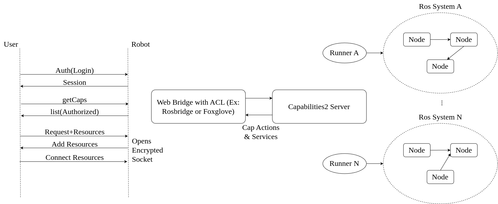
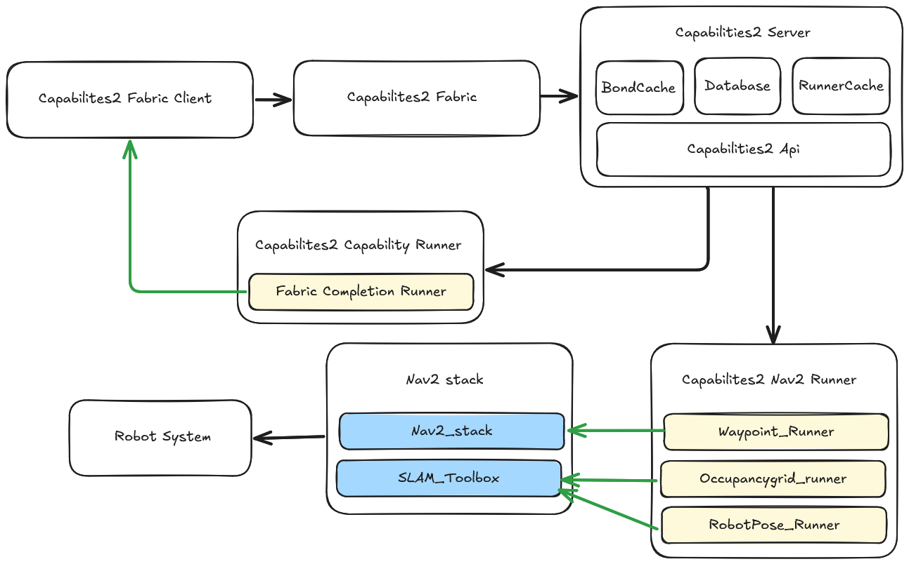
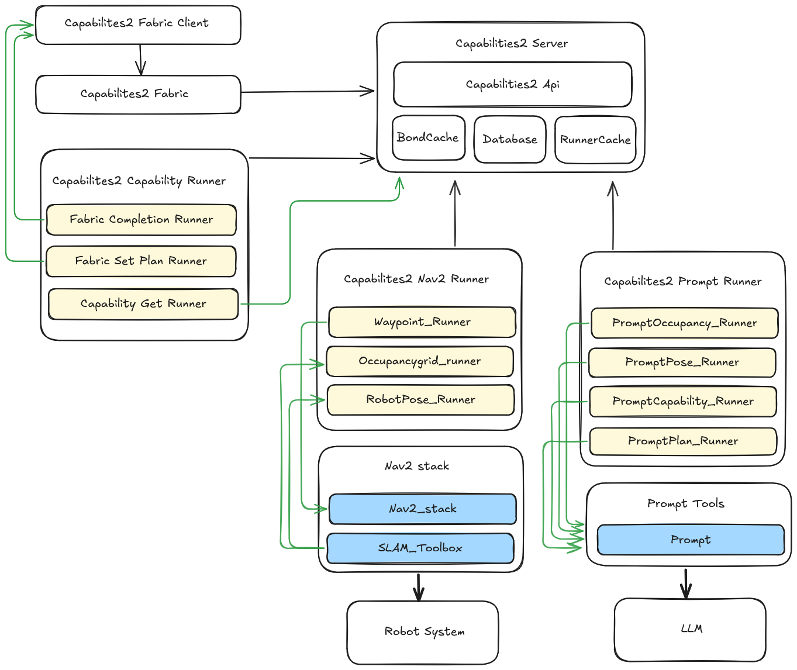

## Results and Discussion

The Capabilities2 paper presents this contribution primarily as a systems and design result rather than as a benchmark-driven experimental study. The key outcome is a ROS2 capability framework that expands the use cases of the original Capabilities package and demonstrates how capability abstractions can support practical HRI workflows, cross-platform reuse, and higher-level task planning.

### New application scenarios enabled by Capabilities2

By moving capability execution into a runner-based plugin architecture, Capabilities2 allows capabilities to be started, queried, chained, and managed through multiple control mechanisms instead of only through launch-time orchestration. The paper highlights several concrete scenarios that become more feasible with this design.

1. Non-engineering HRI researchers can ask what a robot can do and how to use it through a more descriptive capability interface, reducing the learning curve for multidisciplinary teams.
2. HRI experiments can be ported between robots more easily because capability specifications are separated from robot-specific implementations.
3. A universal mobile application for robot control becomes more realistic because external software can target standardised capability interfaces instead of subsystem-specific ROS primitives.
4. Generative AI can use capabilities as a knowledge base for task derivation while leaving deterministic execution to the robot's runner infrastructure.
5. Behaviour-level access control becomes easier to impose when capabilities are mediated through a protected server and proxy rather than exposing sensitive subsystem interfaces directly.

### Example HRI workflow

The paper illustrates the practical value of Capabilities2 with a simple survey-interaction example. An HRI researcher who needs a robot to ask questions and respond differently based on user input would otherwise need to script each behaviour manually and glue those behaviours together with implicit logic. Capabilities2 supports a more reusable alternative: existing capabilities can be discovered, composed into a more expressive behaviour model, and published in a way that is easier for other researchers to reproduce and compare.

The significance of this example is not a numerical result but a shift in development practice. The framework moves effort away from repeatedly engineering low-level wrappers and toward describing reusable capabilities and their relationships.

### Limitations and discussion

The paper also identifies two important limitations. Launch-style execution from Capabilities(1) still requires a launch runner and a Python-based proxy node because of the structure of the ROS2 launch system. In addition, Capabilities2 intentionally does not include a full world model. That omission keeps the package simpler and more extensible, but it means world-state reasoning must be provided by specialised subsystems or plugins rather than by the core framework itself \cite{davis2014representations}.

This design choice is defensible in HRI, where world models are often domain specific and tightly coupled to the interaction problem. Avoiding a built-in world model reduces duplication with subsystem state such as maps or task-specific knowledge, but it also leaves an integration burden for systems that require richer situational reasoning.

### Future development directions

The paper proposes several extensions that follow naturally from the current design: additional database and ORM backends including RDF and vector-based approaches, a reimplementation of a `std_capabilities` package for common robot skills, closer alignment of the runner API with behaviour-tree composition, and shared-memory mechanisms that would allow multiple runners to cooperate over a scoped task state.

For this thesis, these future directions are important because they show how Contribution 1 acts as enabling infrastructure. Capabilities2 establishes the abstraction layer needed for later work on more adaptive planning, richer behaviour composition, and the integration of generative models into robot control pipelines.

### Preliminary thesis evaluation material from the LaTeX chapter

The LaTeX version of this chapter also included preliminary evaluation scaffolding for the wider Capabilities2 Fabric system. Although those sections are clearly incomplete and contain pending entries rather than finished measurements, they capture useful information about the intended evaluation surfaces and should remain consolidated here.

#### Plan execution functionality

The draft evaluation used multiple navigation-related runners to test whether Fabric could coordinate grounded execution plans through the Capabilities2 framework. The stated runner set included a Fabric Completion Runner for execution lifecycle notifications, a Waypoint Runner for Nav2 `NavigateToPose` requests, an OccupancyGrid Runner for map extraction, and a RobotPose Runner for localisation state.

The draft chapter reported a Gazebo-based simulation setup for single-point and multi-point waypoint navigation plans, with the table below preserved as a snapshot of the earlier evaluation status rather than as a finalized result.

| Navigation plan | Simulated robot | Real robot |
| --- | --- | --- |
| Single point test | Successful | Pending |
| Two point test | Successful | Pending |
| Three point test | Pending | Pending |
| Four point test | Pending | Pending |

#### Plan generation functionality

The LaTeX chapter also outlined a plan-generation evaluation for the combined Fabric, Capabilities2, and Prompt Tools stack. Additional runners were described for retrieving capability information, transferring plans back to the Fabric client, and prompting occupancy, pose, and capability information to the language-model interface.

That section framed the intended task family around generating navigation plans of increasing complexity in simulation. The preserved draft table below remains incomplete, but it records the planned evaluation axes of success status and number of planning iterations.

| Task | Success status | Number of planning iterations |
| --- | --- | --- |
| Single point test | Pending | Pending |
| Two point test | Pending | Pending |
| Three point test | Pending | Pending |
| Four point test | Pending | Pending |

#### Interpreting the draft results material

These draft evaluation sections should be read cautiously. They do not yet constitute a complete empirical study, and several entries remain pending. Their value is mainly documentary: they record the intended experimental decomposition of Contribution 1 into execution functionality, plan-generation functionality, and later performance analysis. Keeping them in the markdown chapter ensures that the earlier thesis-specific system context is not lost even though the finalized paper focused on the Capabilities2 framework itself rather than the whole planning stack.

### GPSFSM evaluation of Fabric and PromptTools

The GPSFSM paper provides the most complete current evaluation of the wider Fabric, Capabilities2, and PromptTools stack, so its results are directly relevant to the thesis-level understanding of Contribution 1. Unlike the Capabilities2 paper, which focuses on system design and use cases, the GPSFSM paper evaluates the generative behaviour-planning pipeline itself.

#### Generative experiment design

The first GPSFSM experiment evaluates generative functionality using navigation tasks because they are reproducible in both simulation and simple hardware with minimal changes. Five simulation tasks were defined with increasing difficulty and with progressively richer recovery structure:

1. single navigation point;
2. four navigation points;
3. four navigation points with one recovery point;
4. four navigation points with two recovery points; and
5. four navigation points with four recovery points.

Tasks 1 and 2 represent normal behaviour sequences, while Tasks 3 to 5 integrate recovery behaviours, some of which are expected to be exercised and others to remain unused. The paper reports local and cloud LLM evaluations, with local models running on a workstation with a 16-core Intel Xeon CPU, 256 GB RAM, and an NVIDIA RTX 3090 with 24 GB memory. Generation time from request to response was recorded as a key evaluation metric.

#### Benchmarking setup against BTGenBot

The GPSFSM paper benchmarks Fabric against BTGenBot as the state-of-the-art ROS2-compatible generative behaviour-tree framework. To make the comparison more defensible, the paper restricts Fabric prompts to Nav2 waypoint-navigation and plan-generation information, augments the BTGenBot one-shot prompt with recovery examples, and uses the original base and fine-tuned model variants provided by the BTGenBot authors without further fine-tuning for Fabric plans.

Both systems were evaluated for 10 iterations per task in zero-shot and one-shot modes across seven LLM configurations: Codellama base and fine-tuned, Llamachat base and fine-tuned, and OpenAI GPT-4o, GPT-4.1, and GPT-5. Plans were tested in simulation and reviewed by three human evaluators, who classified outputs as failed, partial, or successful. Failed runs included corrupted or incomplete plans. Partial runs were either syntactically correct or semantically correct but not both. Successful runs were both syntactically and semantically correct.

#### Generative results

The headline result is that Fabric plan generation performed strongly across the GPT models. Aggregated across tasks, the GPSFSM paper reports 90% success and 10% partial success for Fabric on GPT-based generation, compared with 54% success, 11% partial success, and 34% failed for BTGenBot. The paper attributes much of BTGenBot's success to one-shot prompting, suggesting that BT-style generation is more dependent on examples in the prompt.

For local models, the picture changes. BTGenBot outperformed Fabric overall, with 13% success, 35% partial success, and 52% failed, while Fabric achieved 10% success, 22% partial success, and 68% failed. The paper notes that one-shot Fabric prompts caused Codellama and Llamachat to reproduce the prompt example itself, which the authors interpret as likely evidence of context-window limitations in the local models. Zero-shot prompts, being shorter, yielded better results for these local models.

The paper also reports characteristic failure modes. BTGenBot failures included invalid leaf-node names, parameters, or tree structures. Fabric failures included invalid runner names, invalid parameters, or incorrect runner nesting. In both systems, failure rates increased with task complexity.

Generation time also increased with task complexity. Cloud models and local models exhibited substantial latency differences for both systems, and GPT-5 behaved as an outlier by sitting between the faster GPT-4.x models and the slower local models while also achieving stronger reasoning performance. The paper specifically highlights GPT-5's success on BTGenBot zero-shot generation where GPT-4.1 and GPT-4o failed.

#### Complex behaviour experiment

The second GPSFSM experiment demonstrates more complex real-world behaviours rather than benchmarking against a direct competing system. These tasks combine navigation with perception and human interaction, and they are intended to showcase the practical scope of the full Fabric, Capabilities2, and PromptTools pipeline.

The paper reports three tasks of increasing difficulty:

1. move to one metre and describe the surroundings;
2. move to a given location, ask for a person's name, return, and repeat the name; and
3. move to a given location, ask for a person's name, return and repeat the name, and if the person is not present, move to a different location.

These experiments used cloud LLMs and a TurtleBot4 with a laptop mounted on top. According to the paper, the robot ran localisation and Nav2, while the laptop ran perception, Fabric, Capabilities2, and PromptTools. The paper uses these experiments as demonstrations of end-to-end capability rather than as a direct numeric comparison because the authors could not identify another system implementing an equivalent full generation pipeline.

#### Interpretation for Contribution 1

These GPSFSM results materially strengthen the thesis account of Contribution 1. They show that the Fabric and PromptTools extensions are not merely speculative architecture: they were exercised in both controlled generation benchmarks and more complex end-to-end demonstrations. They also clarify a practical trade-off that matters for this contribution. Rich, structured capability descriptions and prompt buffers improve grounding and performance for strong cloud models, but the same richness can stress smaller local models with limited context windows.
