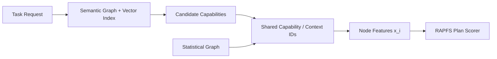

# Knowledge Representation for Robotic Experience

CoreGraphRAG of the Experience stack uses two linked representations as its knowledge store: a semantic graph and a statistical graph. They share stable capability and context IDs, but provide different functions.

- The **semantic graph** contains semantic information related to capability based planning and focuses on things like: what is this capability, what is it related to, what it depends on and why is it relevant to the current task?

- The **statistical graph** contains empirical performance data and focuses on things like: how has this capability actually performed under comparable conditions? was it successful, how long did it take, what resources did it consume, and what faults were observed?

The Data insertion path to the knowledge store is described in [Data To Knowledge Store](03_02_data_to_knowledge.md). The data read path into the planner score is described in [Knowledge Store To RAPFS](03_05_knowledge_to_rapfs.md). The score itself is defined in [Risk-Aware Plan Feasibility Score](03_04_risk_aware_plan_score.md).

## Design Goals

The representation is designed around four requirements.

1. **Separate meaning from measurement.** Semantic relevance is not empirical reliability. A capability can match the task perfectly while still being slow, unreliable, or poorly measured.

2. **Preserve graph structure.** Fabric plans are directed execution graphs, not flat lists. The knowledge store must preserve sequencing, parallelism, and recovery relationships.

3. **Support context-conditioned estimates.** Runtime evidence should be keyed by capability, environment, robot state, and task context when enough data exists.

4. **Keep scores auditable.** Every RAPFS component should be traceable back to evidence rows, estimator versions, normalizers, and active weights.

## 1. Semantic Graph

The semantic graph stores capability nodes, task and context entities, plan patterns, fault concepts, and relationships extracted from descriptions, supervisor context, external documents, user task text, and prior plans. The GraphRAG core clusters this graph into communities so retrieval can happen at multiple granularities: 

- node level for precise skill lookup,
- edge level for dependency or interaction reasoning,
- community level for broader task context.

This is the part of the system that answers questions such as:

- Which capabilities are related to the current task?
- Which dependencies and recovery patterns frequently appear together?
- Which capability communities are relevant to the requested objective?
- Which previous plans or recovery patterns are semantically similar?

### Semantic Node Types

| Node type | Purpose |
|---|---|
| Capability | A capability available in the system and planner can use to build the Fabric instance |
| Task Entity | task related information, such as objectives, constraints, and parameters |
| Context Entity | objects, people, places, and conditions in the environment |
| Plan pattern | reusable execution structures such as sequences, parallel, and recovery paths |
| Fault concept | possible fault instances from supervisor summarised and clustered |

### Semantic Edge Types

| Edge | Meaning |
|------|---------|
| `capability_depends_on` | capability depends on another capability for its execution |
| `capability_interacts_with` | capability interacts with context entity |
| `capability_can_do` | capability can be used to complete a task objective |
| `capability_recovery_for` | capability can be used to recover from another capability |
| `capability_can_cause` | capability can cause a fault instance |
| `capability_helps_recover` | capability can help recover from a fault instance |
| `capability_recovers_capability` | one capability is used as a recovery path for another |
| `capability_precedes_capability` | one capability often appears before another in prior plans |
| `plan_pattern_contains_capability` | plan pattern includes a capability as part of its reusable structure |
| `plan_pattern_has_recovery_path` | plan pattern contains a recovery branch or fallback structure |
| `capability_internally_expects_input` | capability expects certain inputs from other capabilities |
| `capability_internally_provides_output` | capability provides outputs to other capabilities |
| `capability_externally_expects_input` | capability expects certain inputs from context entity |
| `capability_externally_provides_output` | capability provides outputs to context entity |
| `task_entity_related_to_context_entity` | task entity is related to a context entity |
| `context_entity_requires_task_entity` | context entity requires a task entity to be completed |
| `fault_emitted_by` | fault concept was observed from a source component |

### Vector Index Companion

The semantic graph should be paired with a vector index for free-text fields:

- capability descriptions,
- task requests,
- log descriptions,
- external documents,
- plan summaries.

Graph retrieval supplies structured neighbors; vector retrieval supplies fuzzy semantic similarity. Together they support candidate capability retrieval and the unfamiliarity component of uncertainty.

## 2. Statistical Graph

The statistical graph is the empirical layer. It stores runtime evidence and estimator state rather than descriptive meaning. This includes:

- execution success and failure rates,
- runtime duration,
- battery or energy consumption,
- observed fault frequencies and severities,
- resource demand once quantitative telemetry is available,
- plan-level terminal outcomes for validating whole-plan scores.

### Statistical Node Types

| Node type | Purpose |
|---|---|
| Capability | Default aggregate evidence for one capability. Contains aggregated statistics for execution success/failure rates, runtime duration, battery or energy consumption, and observed fault frequencies and severities |
| Context entity | Task, environment, robot, or mission context. |

### Statistical Edge Types

| Edge | Meaning |
|---|---|
| `success_rate` | edge success rate that indicates the probability of successful execution between capability - capability nodes and capability - context entity nodes |

### Stored Evidence Shape

For each capability and context entity key as well as edge key, the statistical graph should keep the state and historical data needed to estimate the planning vector:

$$
x_i=[p_i,t_i,e_i,f_i,\\mathbf{r}_i,u_i].
$$

| Term | Stored evidence |
|---|---|
| $p_i$ | run starts, completed runs, successes, failures, aborts, terminal outcome labels |
| $t_i$ | valid duration samples, count, sum, sum of squares, optional recency windows |
| $e_i$ | battery or energy deltas, count, sum, sum of squares |
| $f_i$ | severity-specific fault counts and exposure |
| $\\mathbf{r}_i$ | CPU, memory, network, storage, actuator effort, and peak/concurrent usage when available |
| $u_i$ | posterior variances, interval widths, sample counts, missing-evidence flags, unfamiliarity signals |

The current supervisor message already supports $p_i$, $t_i$, $e_i$, and $f_i$ in partial or strong form. It does not yet provide quantitative resource measurements, so $\\mathbf{r}_i$ remains missing until resource telemetry is added.

## Linking Semantic And Statistical Graphs

The two graphs should not be merged into one untyped structure. Instead, they should share identity keys and expose explicit joins.

The join pattern is:

1. retrieve semantically relevant capabilities and context,
2. resolve each candidate to stable capability/context IDs,
3. fetch matching statistical rows,
4. fall back to broader aggregates when specific evidence is sparse,
5. increase uncertainty when fallbacks or missing inputs are used.

This design prevents a common modeling error: treating semantic similarity as if it were probability of success. Similarity helps choose candidates and estimate unfamiliarity; empirical success comes from runtime evidence.