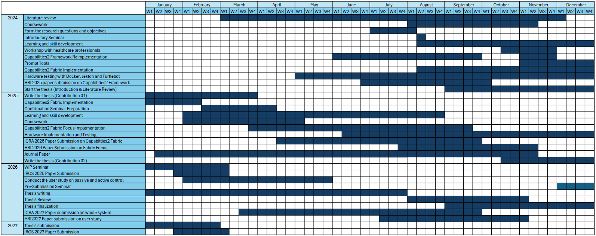

## Chapter Outline

Chapter Literature Review contains a comprehensive literature review on the background concepts. First, literature related to robotic systems is discussed in Section Focus 1. Then, long-horizon task planning is discussed in Section Focus 2. Finally, literature on socially aware navigation is discussed in Section Focus 3.

In Chapter Contribution 1, the authors start with a literature review on behaviour-based systems in the literature section. Then, they propose a new behaviour-based planning system called Fabric in the methodology section. Following this, they provide the evaluation of the system in the results section and a conclusion in the conclusion section.

In Chapter Contribution 2, the authors start with a literature review on attention systems in the literature section. Then, they propose a new attention module called Fabric Attention in the methodology section. Following this, they evaluate the system in the results section and conclude in the conclusion section.

In Chapter Contribution 3, the authors begin with a comprehensive literature review on user studies for socially aware navigation robotic systems and on user studies for the acceptance of robotic systems in the literature section. Then, they provide details on the interaction-based socially assistive robot they developed for the study, as well as the user studies they designed for system evaluation, in the methodology section. Following this, they present the evaluation results of the survey in the results section and provide a conclusion in the conclusion section.

Chapter Results and Discussion contains a compilation and a summary of all the discussions detailed in previous sections.

Chapter Conclusions contains a summary of the research, the achieved contribution to the research field, and possible future work.

## Timeline

Figure: Expected Timeline.
